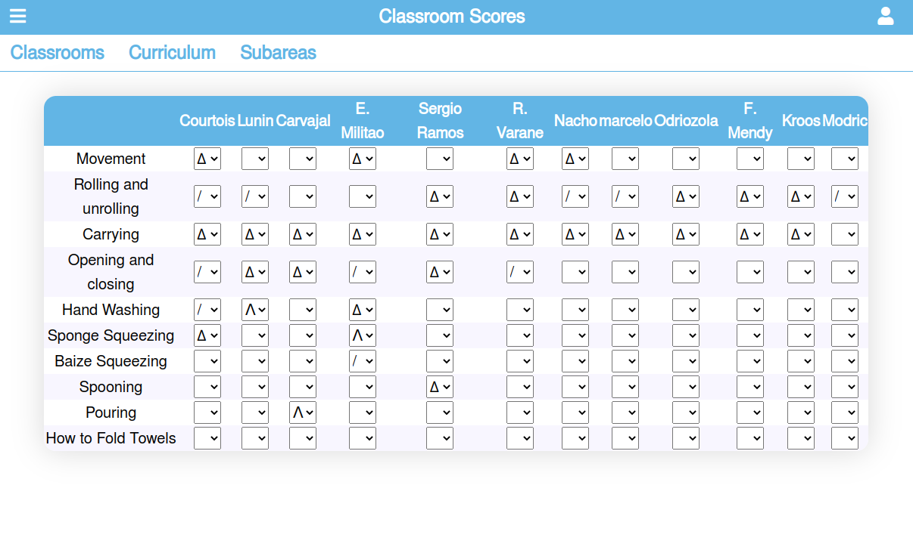

# School tracking application

## Table of Contents

- [About the Project](#about-the-project)
- [Description](#description)
- [Built With](#built-with)
- [Live Demo](#live-demo)
- [Getting Started](#getting-started)
- [Testing](#testing)
- [Authors](#authors)
- [Contributing](#contributing)
- [Show your support](#show-your-support)
- [License](#license)
- [Acknowledgements](#acknowledgements)

## About the Project

This is a web application to track the evolution of school students in the curriculum.

The front end is built with [React](https://reactjs.org/) and [Redux](https://redux.js.org/).

The back end is built with [Ruby on Rails](https://rubyonrails.org/), and has been deployed to [Heroku](https://www.heroku.com/)

[PostgreSQL](https://www.postgresql.org/) is the database employed to store the data.

## Description

There is a menu where you can select:
- Classroom: Here you can see all the classrooms of the school
- Curriculum: To see the all the topics that are included in the curriculum
- Subareas: The main categories in which the topics are divided

### Classrooms
If you select one of the classroom you can get a list of all the students that belong to that classroom. In any of these students there is a link to get all the scores assigned to that student.

### Curriculum
If you select one of the topics you will get all the subareas in which that topic is divided. If you click in any of these subareas you will get all that exercises that belong to that subrea.

### Subareas
If you click in any of the subareas you will get a list with all the exercises that are included in that subarea.

The scores are classified this way:
- / : Close
- ꓥ : Achived
- 𐊅 : Exceeded

## Built With

- [JavaScript](https://en.wikipedia.org/wiki/JavaScript)
- [React](https://reactjs.org/)
- [Redux](https://redux.js.org/)
- [Node package manager](https://www.npmjs.com/)
- [Ruby](https://www.ruby-lang.org/en/)
- [Ruby on Rails](https://rubyonrails.org/)
- [HTML5](https://en.wikipedia.org/wiki/HTML5)
- [CSS](https://www.w3schools.com/Css/)

## Live Demo

[Live Demo Link](https://zappat0n.github.io/school-tracker/)

## Getting Started

To get a local copy up and running follow these simple example steps.

1. On the project GitHub page, navigate to the main page of the repository.
2. Under the repository name, locate and click on a green button named `Code`.
3. Copy the project URL as displayed.
4. If you're running the Windows Operating System, open your command prompt. On Linux, Open your terminal.
5. Change the current working directory to the location where you want the cloned directory to be made. Leave as it is if the current location is where you want the project to be.
6. Type git clone, and then paste the URL you copied in Step 3.  
   e.g. $ `git clone https://github.com/Zappat0n/school-tracker.git`
7. Press Enter. Your local copy will be created.
8. On your console, move to the place where this folder is cloned
9. Create a file named `.env` in the root folder of the application with the following lines   `REACT_APP_SERVER=[address of the backend]` 
`REACT_APP_CLIENT_ID=[id of the application in the backend]` 
`REACT_APP_CLIENT_SECRET=[secret of the application in the backend]`
10. Run `npm start`, then server is automatically opened

## Getting Started

To test the project you just need to run `npm run test`.

## Authors

👤 **Angel Barros**

- GitHub: [@Zappat0n](https://github.com/Zappat0n)
- LinkedIn: [LinkedIn](https://www.linkedin.com/in/angel-barros/)

## Contributing

Contributions, issues, and feature requests are welcome!
Feel free to check the [issues page](../../issues).

1. Fork the Project
2. Create your Feature Branch (`git checkout -b feature/AmazingFeature`)
3. Commit your Changes (`git commit -m 'Add some AmazingFeature'`)
4. Push to the Branch (`git push origin feature/AmazingFeature`)
5. Open a Pull Request

## Show your support

Give a ⭐️ if you like this project!

## License

This project is [MIT](./LICENSE) licensed.

## Acknowledgements

- [React](https://reactjs.org/)
- [Redux](https://redux.js.org/)
- [Ruby on Rails](https://rubyonrails.org/)
